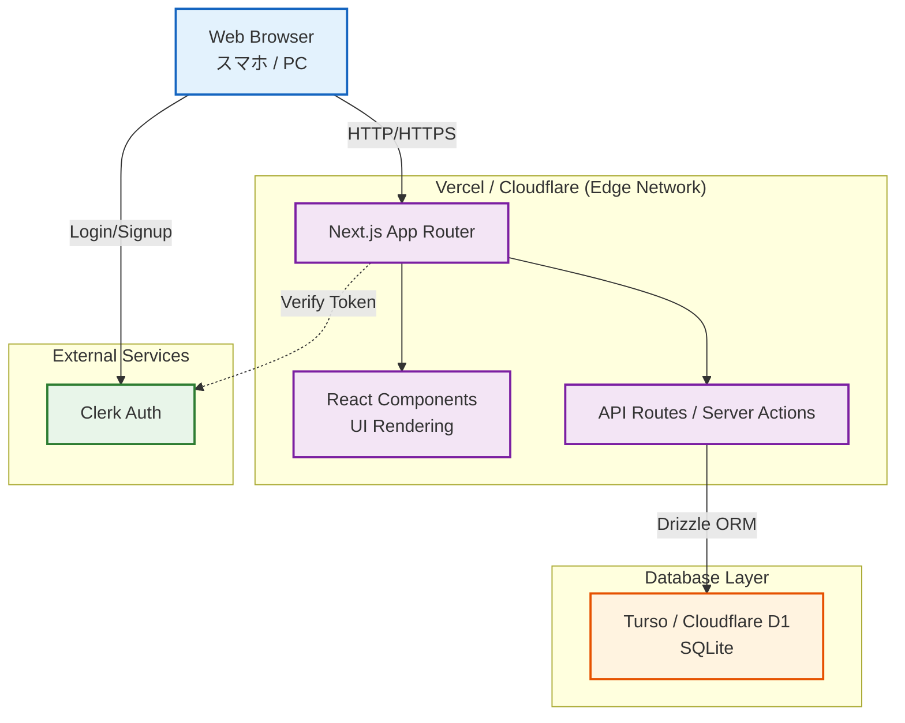

# 02. 基本設計書 (Architecture Design)

## 1. システムアーキテクチャ

CloudWorkbook は、高いパフォーマンスとグローバルな可用性を確保するため、エッジコンピューティング環境を前提としたアーキテクチャを採用する。

### 1.1. 構成要素

- **Frontend / Backend**: Next.js App Router (または React + Hono/Cloudflare Workers構成)
  - ユーザーインターフェースの描画、ルーティング
  - サーバーサイドレンダリング(SSR) / 静的サイト生成(SSG)
  - APIエンドポイント（バックエンドロジック）のホスティング
- **Database**:
  - メインデータストア: Turso または Cloudflare D1（エッジレプリケーション可能なSQLiteベースデータベース）
  - ORM: Drizzle ORM
- **Authentication**:
  - Clerk（次世代の認証プロバイダ、Next.jsとの親和性が高い）
- **Hosting / Deployment**:
  - Vercel または Cloudflare Pages

## 2. アーキテクチャ図 (Mermaid)



## 3. ディレクトリ構成（主要部分）

```text
cloudworkbook/
├── app/                  # Next.js App Routerのエントリーポイント（画面、APIルーティング）
│   ├── (auth)/           # 認証画面関連
│   ├── api/              # APIエンドポイント
│   ├── exams/            # セクション選択画面
│   ├── mock-test/        # 模擬テスト画面・結果画面
│   ├── history/          # 学習履歴・間違えた問題・お気に入り問題
│   ├── settings/         # 設定画面
│   └── page.tsx          # トップページ
├── backend/
│   ├── db/               # データベーススキーマ、マイグレーション、シードデータ
│   └── api/              # ビジネスロジック、データアクセス層の実装
├── frontend/
│   ├── components/       # 共通UIコンポーネント（Shadcn UIなど）
│   ├── constants/        # アプリ全体で利用する定数（文言など）
│   ├── screens/          # 各ページの主となるコンポーネント
│   ├── stores/           # クライアントサイドの状態管理（Zustandなど）
│   └── types/            # TypeScriptの型定義ファイル
├── docs/                 # ドキュメント・各種設計書
│   └── system_design/    # 本システム設計書一式
└── package.json          # プロジェクト依存関係
```

## 4. 技術スタック詳細

- **言語**: TypeScript (厳密な型定義による安全性確保)
- **フレームワーク**: Next.js (App Router)
- **スタイリング**: Tailwind CSS (Utility-first CSS framework)
- **UIライブラリ**: shadcn/ui (Radix UIベースのアクセシブルなコンポーネント)
- **状態管理**: Zustand (軽量で扱いやすいクライアント状態管理), React QueryまたはSWR (サーバー状態管理)
- **アイコン**: Lucide React
- **ORM**: Drizzle ORM (型安全なTypeScript ORM)
- **認証**: Clerk
