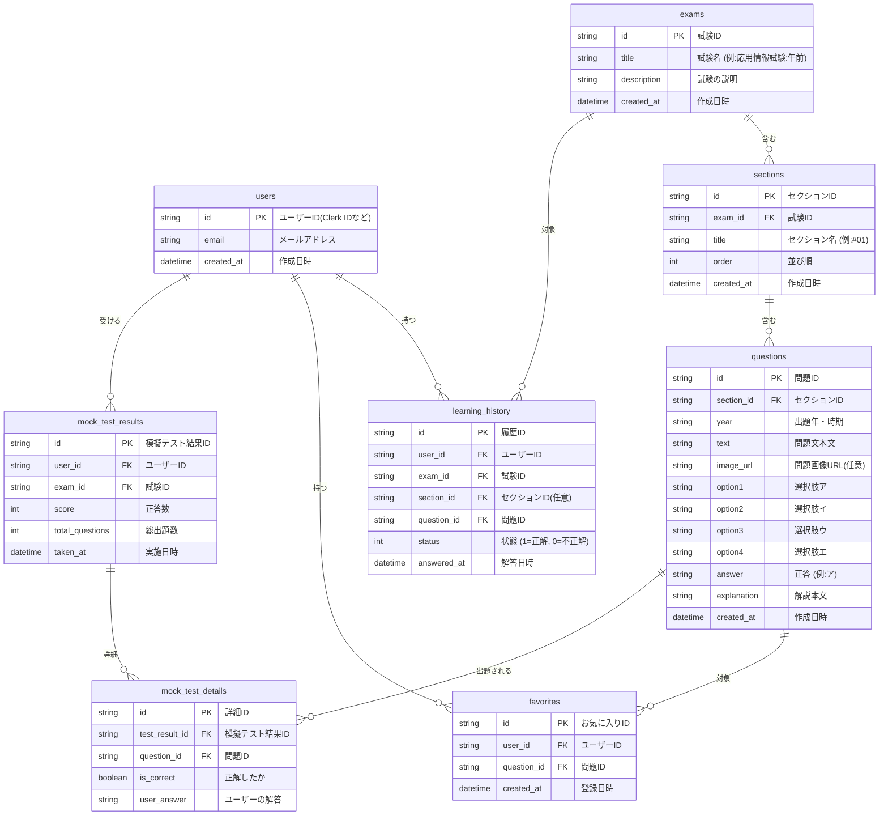

# 03. データベース設計書 (Database Design)

## 1. 概要

本システムは、学習の進捗状況、過去問データ、ユーザーの解答履歴を管理するためにSQLite（Drizzle ORM経由でTurso等に接続）を採用する。
以下は主要なテーブルとその関連を示すスキーマ設計である。

## 2. ER図 (Mermaid)

## 3. テーブル定義詳細

### 3.1. `users` テーブル

ユーザー情報を管理する。認証自体はClerkで行うため、アプリケーション内で必要なメタデータのみ保持する。

| カラム名     | データ型 | 制約         | 論理名・説明                            |
| :----------- | :------- | :----------- | :-------------------------------------- |
| `id`         | text     | PK           | Clerk等が発行する一意の識別子           |
| `email`      | text     | Unique       | ユーザーの連絡先メールアドレス          |
| `created_at` | integer  | Default(Now) | レコード作成日時 (UNIXタイムスタンプ等) |

### 3.2. `exams` テーブル

大分類である「試験」（例: 応用情報技術者試験 早朝、午後など）を定義する。

| カラム名      | データ型 | 制約         | 論理名・説明       |
| :------------ | :------- | :----------- | :----------------- |
| `id`          | text     | PK           | UUIDなどの一意のID |
| `title`       | text     | Not Null     | 試験タイトル       |
| `description` | text     |              | 試験の説明文       |
| `created_at`  | integer  | Default(Now) |                    |

### 3.3. `sections` テーブル

試験ごとの問題セット（例：第1回、あるいは10問ごとの区切りなど）を管理する。

| カラム名     | データ型 | 制約         | 論理名・説明                            |
| :----------- | :------- | :----------- | :-------------------------------------- |
| `id`         | text     | PK           | UUID                                    |
| `exam_id`    | text     | FK(exams.id) | 親となる試験のID                        |
| `title`      | text     | Not Null     | セクション名 (例: 一問一答セクション#1) |
| `order`      | integer  | Not Null     | 表示順序                                |
| `created_at` | integer  | Default(Now) |                                         |

### 3.4. `questions` テーブル

実際の問題データ。4択問題ベースの構造を前提としている。

| カラム名      | データ型 | 制約            | 論理名・説明                                   |
| :------------ | :------- | :-------------- | :--------------------------------------------- |
| `id`          | text     | PK              | UUID                                           |
| `section_id`  | text     | FK(sections.id) | 属するセクションID                             |
| `year`        | text     |                 | 出題年度・期                                   |
| `text`        | text     | Not Null        | 問題文（マークダウンまたはプレーンテキスト）   |
| `image_url`   | text     |                 | 問題文に付随する画像のURL                      |
| `option1`     | text     | Not Null        | 選択肢1 (ア)                                   |
| `option2`     | text     | Not Null        | 選択肢2 (イ)                                   |
| `option3`     | text     | Not Null        | 選択肢3 (ウ)                                   |
| `option4`     | text     | Not Null        | 選択肢4 (エ)                                   |
| `answer`      | text     | Not Null        | 正解となる選択肢のキー (例: option1 または ア) |
| `explanation` | text     |                 | 正解の解説文                                   |
| `created_at`  | integer  | Default(Now)    |                                                |

### 3.5. `learning_history` テーブル

一問一答（セクション学習）を含む、全般的な個別の解答履歴を管理する。

| カラム名      | データ型 | 制約             | 論理名・説明                                                          |
| :------------ | :------- | :--------------- | :-------------------------------------------------------------------- |
| `id`          | text     | PK               | UUID                                                                  |
| `user_id`     | text     | FK(users.id)     | 解答したユーザー                                                      |
| `exam_id`     | text     | FK(exams.id)     | 対象試験                                                              |
| `section_id`  | text     | FK(sections.id)  | 対象セクション (模擬テストなど特定セクションに属さない場合はNull許容) |
| `question_id` | text     | FK(questions.id) | 解答した問題                                                          |
| `status`      | integer  | Not Null         | 1=正解, 0=不正解                                                      |
| `answered_at` | integer  | Default(Now)     | 解答日時                                                              |

### 3.6. `favorites` テーブル

ユーザーが後から復習したい見直し用（ブックマーク）問題を管理する。

| カラム名      | データ型 | 制約             | 論理名・説明             |
| :------------ | :------- | :--------------- | :----------------------- |
| `id`          | text     | PK               | UUID                     |
| `user_id`     | text     | FK(users.id)     | ユーザーID               |
| `question_id` | text     | FK(questions.id) | お気に入り登録した問題ID |
| `created_at`  | integer  | Default(Now)     | 登録日時                 |

### 3.7. `mock_test_results` テーブル

本番形式の「模擬テスト」全体のスコア・サマリを管理する。

| カラム名          | データ型 | 制約         | 論理名・説明               |
| :---------------- | :------- | :----------- | :------------------------- |
| `id`              | text     | PK           | UUID                       |
| `user_id`         | text     | FK(users.id) | 受験したユーザー           |
| `exam_id`         | text     | FK(exams.id) | 全範囲模擬テストの対象試験 |
| `score`           | integer  | Not Null     | 正解した問題数             |
| `total_questions` | integer  | Not Null     | 総出題数 (例: 50)          |
| `taken_at`        | integer  | Default(Now) | 受験日時                   |

### 3.8. `mock_test_details` テーブル

1回の模擬テストで出題された各問題に対する解答詳細を管理する。

| カラム名         | データ型 | 制約                     | 論理名・説明           |
| :--------------- | :------- | :----------------------- | :--------------------- |
| `id`             | text     | PK                       | UUID                   |
| `test_result_id` | text     | FK(mock_test_results.id) | 属する模擬テストID     |
| `question_id`    | text     | FK(questions.id)         | 出題された問題         |
| `is_correct`     | boolean  | Not Null                 | 正解/不正解フラグ      |
| `user_answer`    | text     |                          | ユーザーが選択した解答 |

## 4. セクション構成ルール

詳細は [docs/import_rules/task.md](../import_rules/task.md) を参照。

### 選択式試験（FP / 応用情報午前）
- **5問/セクション**で分割
- description: `年度ラベル 問X〜Y` 形式

### 記述式試験（応用情報午後 / IPA高度試験）
- **1大問＝1セクション**で分割
- description: `年度ラベル 午後 問N [分野名]` 形式
- 応用情報午後は問1〜11が分野固定（情報セキュリティ/経営戦略/プログラミング等）

### 現在のDB登録状況
- 15試験区分、6,872問
- 選択式: FP4種 + 応用情報午前 = 1,760問
- 記述式: 応用情報午後 + IPA高度9区分 = 5,112問

