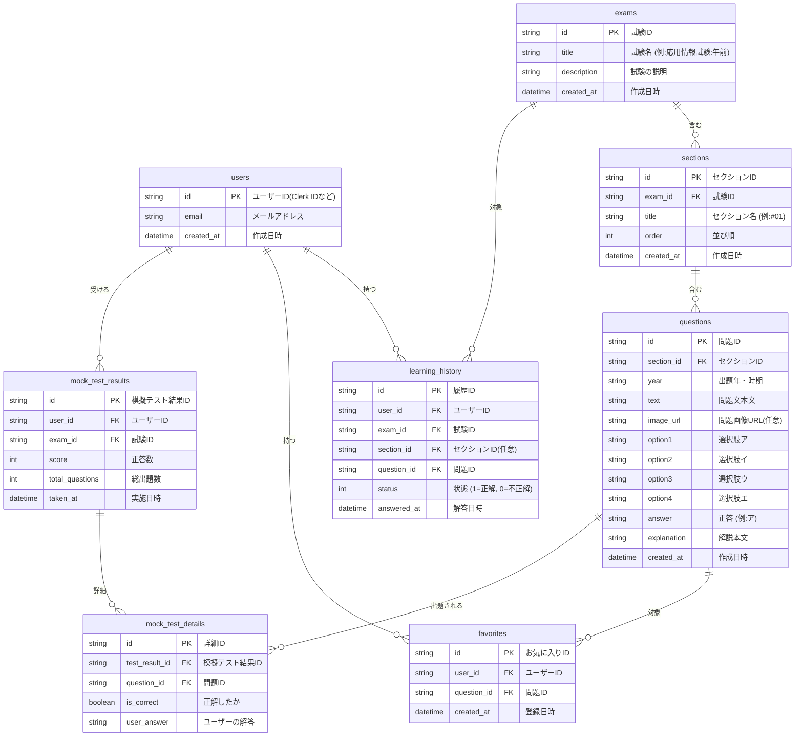

# 03. データベース設計書 (Database Design)

## 1. 概要

本システムは、学習の進捗状況、過去問データ、ユーザーの解答履歴を管理するためにSQLite（Drizzle ORM経由でTurso等に接続）を採用する。
以下は主要なテーブルとその関連を示すスキーマ設計である。

## 2. ER図 (Mermaid)

## 3. テーブル定義詳細

### 3.1. `users` テーブル

ユーザー情報を管理する。認証自体はClerkで行うため、アプリケーション内で必要なメタデータのみ保持する。

| カラム名     | データ型 | 制約         | 論理名・説明                            |
| :----------- | :------- | :----------- | :-------------------------------------- |
| `id`         | text     | PK           | Clerk等が発行する一意の識別子           |
| `email`      | text     | Unique       | ユーザーの連絡先メールアドレス          |
| `created_at` | integer  | Default(Now) | レコード作成日時 (UNIXタイムスタンプ等) |

### 3.2. `exams` テーブル

大分類である「試験」（例: 応用情報技術者試験 早朝、午後など）を定義する。

| カラム名      | データ型 | 制約         | 論理名・説明       |
| :------------ | :------- | :----------- | :----------------- |
| `id`          | text     | PK           | UUIDなどの一意のID |
| `title`       | text     | Not Null     | 試験タイトル       |
| `description` | text     |              | 試験の説明文       |
| `created_at`  | integer  | Default(Now) |                    |

### 3.3. `sections` テーブル

試験ごとの問題セット（例：第1回、あるいは10問ごとの区切りなど）を管理する。

| カラム名     | データ型 | 制約         | 論理名・説明                            |
| :----------- | :------- | :----------- | :-------------------------------------- |
| `id`         | text     | PK           | UUID                                    |
| `exam_id`    | text     | FK(exams.id) | 親となる試験のID                        |
| `title`      | text     | Not Null     | セクション名 (例: 一問一答セクション#1) |
| `order`      | integer  | Not Null     | 表示順序                                |
| `created_at` | integer  | Default(Now) |                                         |

### 3.4. `questions` テーブル

実際の問題データ。4択問題ベースの構造を前提としている。

| カラム名      | データ型 | 制約            | 論理名・説明                                   |
| :------------ | :------- | :-------------- | :--------------------------------------------- |
| `id`          | text     | PK              | UUID                                           |
| `section_id`  | text     | FK(sections.id) | 属するセクションID                             |
| `year`        | text     |                 | 出題年度・期                                   |
| `text`        | text     | Not Null        | 問題文（マークダウンまたはプレーンテキスト）   |
| `image_url`   | text     |                 | 問題文に付随する画像のURL                      |
| `option1`     | text     | Not Null        | 選択肢1 (ア)                                   |
| `option2`     | text     | Not Null        | 選択肢2 (イ)                                   |
| `option3`     | text     | Not Null        | 選択肢3 (ウ)                                   |
| `option4`     | text     | Not Null        | 選択肢4 (エ)                                   |
| `answer`      | text     | Not Null        | 正解となる選択肢のキー (例: option1 または ア) |
| `explanation` | text     |                 | 正解の解説文                                   |
| `created_at`  | integer  | Default(Now)    |                                                |

### 3.5. `learning_history` テーブル

一問一答（セクション学習）を含む、全般的な個別の解答履歴を管理する。

| カラム名      | データ型 | 制約             | 論理名・説明                                                          |
| :------------ | :------- | :--------------- | :-------------------------------------------------------------------- |
| `id`          | text     | PK               | UUID                                                                  |
| `user_id`     | text     | FK(users.id)     | 解答したユーザー                                                      |
| `exam_id`     | text     | FK(exams.id)     | 対象試験                                                              |
| `section_id`  | text     | FK(sections.id)  | 対象セクション (模擬テストなど特定セクションに属さない場合はNull許容) |
| `question_id` | text     | FK(questions.id) | 解答した問題                                                          |
| `status`      | integer  | Not Null         | 1=正解, 0=不正解                                                      |
| `answered_at` | integer  | Default(Now)     | 解答日時                                                              |

### 3.6. `favorites` テーブル

ユーザーが後から復習したい見直し用（ブックマーク）問題を管理する。

| カラム名      | データ型 | 制約             | 論理名・説明             |
| :------------ | :------- | :--------------- | :----------------------- |
| `id`          | text     | PK               | UUID                     |
| `user_id`     | text     | FK(users.id)     | ユーザーID               |
| `question_id` | text     | FK(questions.id) | お気に入り登録した問題ID |
| `created_at`  | integer  | Default(Now)     | 登録日時                 |

### 3.7. `mock_test_results` テーブル

本番形式の「模擬テスト」全体のスコア・サマリを管理する。

| カラム名          | データ型 | 制約         | 論理名・説明               |
| :---------------- | :------- | :----------- | :------------------------- |
| `id`              | text     | PK           | UUID                       |
| `user_id`         | text     | FK(users.id) | 受験したユーザー           |
| `exam_id`         | text     | FK(exams.id) | 全範囲模擬テストの対象試験 |
| `score`           | integer  | Not Null     | 正解した問題数             |
| `total_questions` | integer  | Not Null     | 総出題数 (例: 50)          |
| `taken_at`        | integer  | Default(Now) | 受験日時                   |

### 3.8. `mock_test_details` テーブル

1回の模擬テストで出題された各問題に対する解答詳細を管理する。

| カラム名         | データ型 | 制約                     | 論理名・説明           |
| :--------------- | :------- | :----------------------- | :--------------------- |
| `id`             | text     | PK                       | UUID                   |
| `test_result_id` | text     | FK(mock_test_results.id) | 属する模擬テストID     |
| `question_id`    | text     | FK(questions.id)         | 出題された問題         |
| `is_correct`     | boolean  | Not Null                 | 正解/不正解フラグ      |
| `user_answer`    | text     |                          | ユーザーが選択した解答 |

## 実装履歴: AP午前 過去問DB設計

### task.md

# Task List: AP午前 過去問DB設計・インポート基盤

- [x] 1. データベース設計の確認と実装計画の作成（ユーザー確認待ち）
- [x] 2. データベースマイグレーションの実行
  - [x] `drizzle-kit generate`
  - [x] `drizzle-kit push`
- [ ] 3. 過去問データ管理用ディレクトリの設定
  - [ ] `IPA_kakomon/` ディレクトリの .gitignore 設定 (必要に応じて)
- [x] 4. インポートパイプライン・スクリプトの開発
  - [x] 依存関係の追加 (`papaparse` 等)
  - [x] `scripts/init-exam.ts` (フォルダ初期化スクリプト) の作成
  - [x] `scripts/import-csv.ts` (画像処理とCSVインポート) の作成
  - [x] `scripts/parse-pdf.ts` (PDF解析スクリプト - ベータ版) の作成
- [x] 5. テスト実行と動作確認
  - [x] ダミーの過去問データで動作確認
  - [x] スクリプトの検証

### walkthrough.md

# AP午前 過去問DB設計・インポート基盤 実装完了報告

## 1. 完了した作業と変更されたスキーマ

DBに `ipaCategories` と `examYears` テーブルを追加し、`questions` テーブルの選択肢を NULL 許容にするなどの改修を含め、最新のスキーマを SQLite データベースに反映しました。（`drizzle-kit generate` および `drizzle-kit push` 完了）

**追加・変更された主なモデル:**

- `ipaCategories`: 公式の3階層カテゴリ (テクノロジ系 > 基礎理論 > 離散数学 など)
- `examYears`: 過去問の年度・回 (令和6年度 秋期 など)
- `questions`: `optionC`, `optionD` の Null 許容対応。画像フラグ (`hasImage`) と画像URLの追加。

## 2. インポート基盤スクリプトの開発

以下の3つのスクリプトによって構成される半自動パイプラインを実装しました。
すべてのスクリプトにTypeScriptの型チェックをパスさせています。

### `scripts/init-exam.ts`

過去問のデータセットを構築するための初期ディレクトリ（例: `IPA_kakomon/AP_2024_Autumn/`）と画像格納用の `images/` フォルダ、CSVテンプレートを生成します。

- **実行例:** `npx tsx scripts/init-exam.ts AP 2024 Autumn`

### `scripts/parse-pdf.ts` (ベータ版)

IPA公式などの過去問PDFからテキストを抽出し、問題ごとに分割して `data.csv` の雛形に出力します。画像が多く含まれるため完全な自動抽出は困難ですが、このスクリプトを使うことで手動整形の手間を大幅に削減できます。
（**注意**: ご要望のとおり、このスクリプトは抽出だけを行い、図表などの画像の切り出しは必ず人間が確認しながら指定のフォルダに保存する運用を想定しています。）

- **実行例:** `npx tsx scripts/parse-pdf.ts path/to/question.pdf --year 2024 --season autumn`

### `scripts/import-csv.ts`

作成した CSV (`data.csv`) を読み込み、DBに登録します。この際、以下の自動化処理を行います：

1. **画像のパブリック展開:** `IPA_kakomon/.../images/` 内の画像ファイルを、フロントエンドから参照可能な `public/images/kakomon/.../` に自動コピーします。
2. **Markdownパスの変換:** CSVに記載された `` のようなローカル相対パスを、コピー先のパブリックなパス `` に自動で置換し、DBに保存します。
3. **重複とカテゴリの解決:** 年度と問番号によるユニーク制約やカテゴリの自動生成 (Upsert) を行い、7問単位で自動的にセクションに紐付けます。

## 3. 次のステップ・運用について

1. `npx tsx scripts/init-exam.ts` で任意の回の足場を作ります。
2. PDFから抽出・整形したCSVと、切り出した画像をフォルダ内に配置します。
3. `npx tsx scripts/import-csv.ts` を実行してDBに取り込みます。
4. **フロントエンド側の対応:** 問題文や選択肢に Markdown 形式の文字列が格納されるようになったため、UI コンポーネント側で `react-markdown` 等を利用したレンダリング処理を実装する必要があります。 (※ 今回のタスク範囲外)

## 実装履歴: データインポート改修

### task.md

# Task List: セクション5問分割構成への修正

- [x] 1. `scripts/import-csv.ts` の分割ロジック(7 -> 5)の修正と説明文の修正
- [x] 2. `QuestionListScreen.tsx` のフォールバック長(7 -> 5)およびグリッドレイアウト修正
- [x] 3. `import-csv` 実行により 10セクションに分かれることのスクリプト側確認

### implementation_plan.md

# データの取り込み方法とセクション分割ロジックの修正計画

## 確認された課題

1. 1つの試験（PDF）あたりの問題数が50問であるという要件。
2. これらが5問ずつ、合計10セクションに分割されてシステムに登録されるべきであること。
3. 現在のシステム（`import-csv.ts` およびフロントエンドの描画）は「7問で1セクション」という前提でハードコードされている箇所があること。

## 実装・改修計画

### 1. `scripts/import-csv.ts` の改修

CSVからのデータインポート時にセクションを決定するロジックを、7問区切りから5問区切りに変更します。

- **変更前**: `Math.floor((qNum - 1) / 7) + 1`
- **変更後**: `Math.floor((qNum - 1) / 5) + 1`
- **セクション名のdescription変更**: `問1〜`、`問6〜`、`問11〜` などの連番が正しく登録されるよう、計算式を `(sectionIndex - 1) * 5 + 1` に修正します。

### 2. `frontend/screens/QuestionListScreen.tsx` の改修

フロントエンドで過去問リストを表示する際に、7問前提で作られているUIグリッドを5問前提に修正します。

- **モックデータの長さ変更**: 空のデータを埋める場合 `length: 7` を `length: 5` に変更。
- **グリッドレイアウトの最適化**: 現在 `grid-cols-2 md:grid-cols-4` となっている部分を、5問が綺麗に並ぶよう、例えば `grid-cols-5` やデザインバランスを見て調整します。

### 3. 取り込み時のテストデータ

これまでダミー行が2行しかないテスト用CSVで検証していたため、「明らかに問題数が少ない」という問題が発生しました。
次回からは、正しく50問（あるいはそれ以上）用意された本番用CSV、もしくは50行分のダミーパーサーなどを用いて 10セクション×5問 が作られるかを検証します。

---

この方針で修正を行ってもよろしいでしょうか？問題なければ「実施して」とご指示をお願いします。

