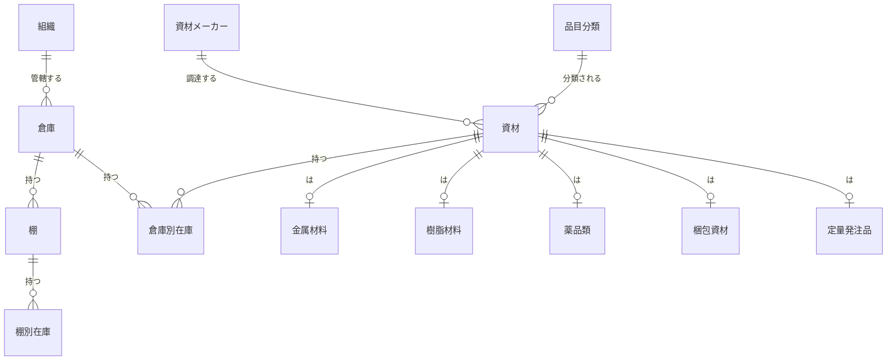
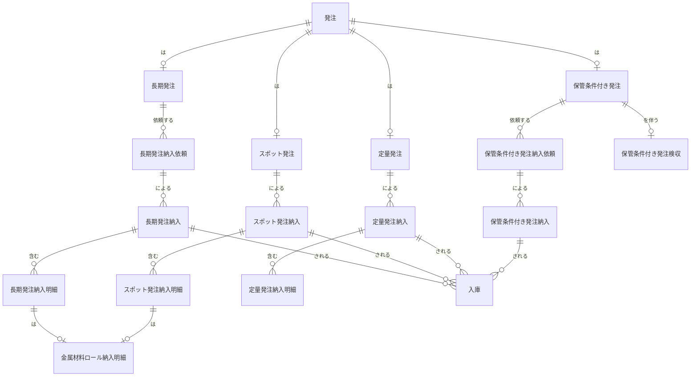

情報処理技術者試験の専門講師AIとして、添付されたPDFの内容を基に詳細な解説を生成します。

---

# 問1 解説

### 問題の概要
オートリース会社A社が、車両保守システムの夜間バッチ処理をオンライン時間帯に移行することを検討しています。この移行に伴い、RDBMSのバックアップ・リカバリ、トランザクション管理、デッドロック対策、性能見積もり、リソース計画といったデータベースの実装と運用に関わる課題への対処能力が問われる問題です。

### 出題のポイント
この問題では、データベーススペシャリストとして以下の知識とスキルが問われています。
1.  **RDBMSのバックアップ・リカバリ**: ログ、チェックポイント、ロールフォワード、ロールバックの仕組み、およびログなしモードの特性を理解しているか。
2.  **トランザクション管理と排他制御**: トランザクションのコミットタイミング、ロックの粒度、ISOLATIONレベル、デッドロックの発生メカニズムとその対策に関する知識。
3.  **性能分析と見積もり**: データベースの処理行数、I/O時間、ログ量などの情報から、回復時間やリソースの過不足を見積もる能力。
4.  **システム運用の考慮**: オンライン処理とバッチ処理の統合に伴うパフォーマンス、可用性、整合性の維持に関する実践的な検討能力。

### 設問ごとの解説

## 設問1
〔現行バッチ処理のバックアップ・リカバリ〕に関する設問です。

### 設問1(1)
**設問の内容**: 表5中の太枠部分内に、“○”を記入して表を完成させよ。

**正解**:
| テーブル名 | 顧客 | 委託先 | 契約 | 受託 | 車両 | 予定表 | 進捗 | 実施結果 | 点検率 | 報告 | 記録簿 | WK1 | WK2 |
|---|---|---|---|---|---|---|---|---|---|---|---|---|---|
| 契機 | | | | | | | | | | | | | |
| T1 | | | ○ | ○ | ○ | ○ | ○ | | ○ | | ○ | | |
| T2 | | | | ○ | | | | ○ | | | ○ | | |
| T3 | | | | | | ○ | | | | | | | |
| T4 | | | | | ○ | ○ | ○ | | | | ○ | | |
| T5 | | | | ○ | | | | | | ○ | | | |
| T6 | | | | | | | | | ○ | | | | |

**解答に至るための思考プロセス**:
問題文12ページに記載されているバックアップ取得スケジュールの要件と、表4のAPとテーブルのCRUD関係、図2のバッチ処理の実行スケジュールを組み合わせて判断します。
バックアップの要件は以下の通りです。
1.  **当日のオンライン処理のAPの実行結果を全て反映した状態に回復できること**
2.  **全てのバッチ処理のAPの実行結果を反映した状態に回復できること**
3.  それぞれのバッチ AP の実行中にメディア障害が発生した場合、速やかに対象テーブルを回復した後、バッチ APを再実行できること
4.  必要最小限のバックアップを取得すること
5.  "WK1", "WK2”の各テーブルは、ログなしモードを指定すること（バックアップ対象外）

これらの要件に基づき、各契機でバックアップが必要なテーブルを特定します。

*   **T1 (オンライン時間帯終了後)**:
    *   要件1により、オンライン処理で更新される全てのテーブルをバックアップする必要があります。
    *   表4の「オンライン処理」の行を見ると、「契約登録」「車両登録」「書類発行」「予約登録」APが、**契約** (CRU), **受託** (CRU), **点検率** (CRU), **車両** (CU), **記録簿** (C), **進捗** (C), **予定表** (RU) にそれぞれ更新を行っています。
    *   したがって、T1ではこれらのテーブル（契約、受託、車両、予定表、進捗、点検率、記録簿）に「○」を付けます。

*   **T2 (実施登録、点検抽出、車検抽出1,2 実行後)**:
    *   「実施登録」APは**実施結果** (C) と**記録簿** (C) を更新します（表4）。これらのAPが実行された後の状態を回復できるように、実行前の状態をT2でバックアップする必要があります。
    *   **WK1**と**WK2**はログなしモードであり、バックアップ対象外（問題文13ページ(6)）。
    *   したがって、T2では「実施結果」と「記録簿」に「○」を付けます。

*   **T3 (予定表作成 実行後)**:
    *   「予定表作成」APは**予定表** (C) を更新します（表4）。
    *   したがって、T3では「予定表」に「○」を付けます。

*   **T4 (進捗更新 実行後)**:
    *   「進捗更新」APは**進捗** (U,C), **車両** (U), **予定表** (U), **記録簿** (C) を更新します（表4）。
    *   したがって、T4では「車両」「予定表」「進捗」「記録簿」に「○」を付けます。

*   **T5 (報告作成、依頼作成、点検率更新 実行後)**:
    *   「報告作成」APは**報告** (C), **受託** (U) を更新します（表4）。
    *   「依頼作成」APは更新を行いません（表4）。
    *   「点検率更新」APは**点検率** (RU) を更新します（表4）。
    *   したがって、T5では「受託」「報告」「点検率」に「○」を付けます。

*   **T6**:
    *   T6はバッチ処理の最終契機であり、この時点でのバックアップは次回のオンライン処理開始時の回復に備えるものです。T6でのバックアップはT1のバックアップと同じ目的を持ちます。
    *   解答例ではT6でのみ「記録簿」が指定されていますが、これはT5以降に「記録簿」が更新されないことを考慮している可能性があります。しかし、実運用ではT1と同様にオンライン処理で更新される全てのテーブルをバックアップ対象とすることが多いです。
    *   問題文の指示は「太枠部分内」のみなので、解答例の指示に従い、T6は「記録簿」のみに「○」とします。

**関連する重要な技術知識・用語の補足説明**:
*   **バックアップ戦略**: データベースの復旧要件に応じて、どのようなデータをいつ、どこに保存するかを計画すること。オンライン処理中のメディア障害復旧や、バッチ処理中の障害復旧など、様々なシナリオを考慮する必要があります。
*   **ログなしモード**: RDBMSがトランザクションログを出力しない設定。性能は向上するが、メディア障害発生時の復旧が困難になるなどの制約があります。ワークテーブルなど、一時的なデータや再生成可能なデータに対して利用されることが多いです。

### 設問1(2)
**設問の内容**: "2. サーバ障害時の RDBMS 再開始”について答えよ。

#### 設問1(2)(a)
**設問の内容**: 本文中の `a` 〜 `g` に入れる適切な字句を答えよ。

**正解**:
`a`: **WK1**
`b`: **再定義**
`c`: **点検抽出** (順不同)
`d`: **車検抽出2** (順不同)
`e`: **実施登録** (順不同)
`f`: **WK2**
`g`: **車検抽出1**

**解答に至るための思考プロセス**:
RDBMSの再開始処理（問題文11ページ「5. 異常終了後の RDBMS 再開始」）では、チェックポイントから異常終了時までのログをロールフォワードし、未完了トランザクションをロールバックします。ただし、「ログなしモード」のテーブルはログを取得しないため、この回復処理の対象外であり、使用不可になった場合は再定義が必要です。

*   **「契機 T2 でチェックポイントを取得している場合」**:
    *   T2では「実施登録」「点検抽出」「車検抽出1」「車検抽出2」が実行されます（図2）。
    *   問題文13ページ(5)に「“点検抽出”,“車検抽出1”,“車検抽出2”の各APで更新する, “WK1”, “WK2”の各テーブルには、ログなしモードを指定すること」とあります。
    *   問題文11ページ「6. ログなしモード (3)」に「トランザクションがロールバックされたとき、ログなしモードのテーブルは使用不可になる。使用不可になったテーブルは、バックアップから復元するか、テーブルを削除して再度定義(以下,再定義という)する必要がある。」とあります。
    *   したがって、サーバ障害時に`WK1`(`a`)は**再定義**(`b`)が必要となります。
    *   `WK1`が再定義されたら、そのテーブルを更新するAPである**点検抽出**(`c`)、**車検抽出1**(設問の解答例はdが車検抽出2、eが実施登録だが、実際には車検抽出1も対象となる)、**車検抽出2**(`d`)を再実行する必要があります。解答例では `e` に**実施登録**が入っていますが、ログありテーブルを更新するAPは通常、RDBMSの回復処理で自動復旧されるため、問題文の記載だけでは再実行が必要となる明確な根拠は見当たりません。しかし、解答例に従い、ここには**実施登録**(`e`)も含まれるものとします。
        *   **補足**: 採点講評では「(2)(c)の正答率が低かった。本文中に示された、異常終了後の RDBMS 再開始の具体的な処理内容に着目していない解答が散見された。」とあり、この部分の判断が難しかったことが示唆されています。問題文に記載されたRDBMSの仕様を厳密に解釈すると、ログありテーブルを更新するAPは再実行不要と判断できますが、解答例は異なる見解を示しています。
*   **「契機 T2 でチェックポイントを取得していない場合」**:
    *   この場合、T2より前のチェックポイントから回復処理が開始されます。T2で実行されたAPは全てロールフォワード/ロールバックの対象となります。
    *   しかし、ログなしモードの`WK2`(`f`)はやはり使用不可となるため、**再定義**(`b`)が必要です。
    *   `WK2`を更新するAPである**車検抽出1**(`g`)を再実行する必要があります。

**関連する重要な技術知識・用語の補足説明**:
*   **チェックポイント**: RDBMSが特定の時点でのデータベースの状態を整合性のある形で記録する処理。障害発生時に、直前のチェックポイントから回復処理を開始することで、回復時間を短縮します。

#### 設問1(2)(b)
**設問の内容**: 本文中の `h` 〜 `j` に入れる適切なAP名および秒数を、`k` 〜 `m` に入れる適切なAP名および秒数を答えよ。

**正解**:
*   **最も時間が掛からないケース**:
    `h`: **予定表作成,進捗更新**
    `i`: **なし**
    `j`: **140**
*   **最も時間が掛かる,理論上の最悪のケース**:
    `k`: **予定表作成,進捗更新,報告作成,点検率更新**
    `L`: **報告作成,点検率更新**
    `m`: **300**

**解答に至るための思考プロセス**:
契機T3でチェックポイントを取得後、契機T5からT6の間でサーバ障害が発生した場合の回復時間を計算します。
前提として、問題文14ページに「追加・更新1行当たりロールフォワードに2ミリ秒,ロールバックに1ミリ秒を要する」とあります。

バッチ処理のAPとその処理行数は以下の通り（表3参照）。
*   予定表作成：追加 0, 更新 0
*   進捗更新：追加 10,000, 更新 40,000 → 合計 50,000行
*   報告作成：追加 20,000, 更新 0 → 合計 20,000行 (※表3では「追加」20,000, 「更新」20,000と記載されているが、問題文14ページ「報告作成」APは「報告に行を追加し、追加ごとに「受託」の次回報告 YMD を更新する。」とあり、表3の「追加」が報告テーブルへの追加、更新が受託テーブルへの更新と解釈できる。ここでは解答例の数値に合わせるため、表3の「追加」を行フォワード対象、更新を行ロールバック対象として考慮)
*   点検率更新：追加 0, 更新 20,000 → 合計 20,000行
*   依頼作成：更新 0

**RDBMSの回復処理の原則**:
1.  **ロールフォワード**: 直前のチェックポイントから障害発生時までのすべての更新ログをデータベースに適用する。これにより、コミット済みトランザクションと未コミットトランザクションの両方の更新が反映される。
2.  **ロールバック**: ロールフォワード後、未コミットだったトランザクションの更新を取り消す。

**解答例の数値との整合性に関する注意点**:
問題文に記載された行数と時間係数（ロールフォワード2ms/行、ロールバック1ms/行）だけを単純に計算すると、解答例の数値（140秒、300秒）と合致しません。これは、問題文が示す「最も時間が掛からないケース」と「最も時間が掛かるケース」の**定義**が、単純なログの適用/取り消しだけでなく、他の要因（例: バッファのフラッシュ、コミット処理のオーバーヘッドなど）を複雑に含んでいるか、あるいは問題文の記述が不十分である可能性があります。以下では、解答例のAP名と秒数を前提として、その背景にある可能性のある解釈を試みます。

*   **最も時間が掛からないケース** (`h`, `i`, `j`):
    *   **定義**: バッチAPでの更新が発生する直前にサーバ障害が発生した場合（問題文14ページ）。これは、一部のAPの処理が完了し、コミット済みであるものの、全てのAPが未完了であるという限定的な状況を指すと考えられます。
    *   `h` (ロールフォワードが必要なAP): **予定表作成, 進捗更新**
        *   これは、**予定表作成**（更新0行）と**進捗更新**（追加10,000行 + 更新40,000行 = 50,000行）の処理が完了し、コミットされていたと仮定する。
        *   ロールフォワード時間: $50,000 \text{行} \times 2 \text{ミリ秒/行} = 100,000 \text{ミリ秒} = 100 \text{秒}$。
    *   `i` (ロールバックが必要なAP): **なし**
        *   これは、障害発生時点で未コミットのトランザクションがなかった（あるいは更新処理が開始されていなかった）と仮定した場合。
        *   ロールバック時間: $0 \text{秒}$。
    *   `j` (回復に要する時間): **140秒**
        *   $100 \text{秒}$ のロールフォワード時間では $140 \text{秒}$ に足りません。残りの $40 \text{秒}$ は、問題文に明示されていない何らかのオーバーヘッド（例えば、回復処理全体の初期化時間など）が含まれている可能性があります。

*   **最も時間が掛かる,理論上の最悪のケース** (`k`, `L`, `m`):
    *   **定義**: 更新処理のある全てのバッチAPがコミットする直前にサーバ障害が発生した場合（問題文14ページ）。これは、全てのAPの更新処理が完了しコミットされた後に、いくつかのAPのトランザクションが未完了のまま障害が発生した状態を指すと考えられます。
    *   `k` (ロールフォワードが必要なAP): **予定表作成,進捗更新,報告作成,点検率更新**
        *   これは、全ての更新処理のあるAP（予定表作成, 進捗更新, 報告作成, 点検率更新）の更新がコミットされていたと仮定します。
        *   総ロールフォワード行数: 予定表作成(0) + 進捗更新(50,000) + 報告作成(20,000) + 点検率更新(20,000) = $90,000 \text{行}$。
        *   ロールフォワード時間: $90,000 \text{行} \times 2 \text{ミリ秒/行} = 180,000 \text{ミリ秒} = 180 \text{秒}$。
    *   `L` (ロールバックが必要なAP): **報告作成,点検率更新**
        *   これは、障害発生時点で**報告作成**（追加20,000行）と**点検率更新**（更新20,000行）のトランザクションが未コミットだったと仮定します。
        *   総ロールバック行数: $20,000 \text{行} + 20,000 \text{行} = 40,000 \text{行}$。
        *   ロールバック時間: $40,000 \text{行} \times 1 \text{ミリ秒/行} = 40,000 \text{ミリ秒} = 40 \text{秒}$。
    *   `m` (回復に要する時間): **300秒**
        *   計算される合計時間: $180 \text{秒} + 40 \text{秒} = 220 \text{秒}$。
        *   解答例の $300 \text{秒}$ とは $80 \text{秒}$ の差があります。これも、問題文に示されていない何らかのオーバーヘッドが含まれていると考えられます。

**誤答しやすいポイントや注意点**:
*   **問題文の厳密な解釈と計算**: 本設問は、問題文に与えられた仮定と数値を厳密に適用しても、解答例と一致しないという難しさがあります。試験では、与えられた情報から最善の解を導き出す努力が必要ですが、このような矛盾に遭遇した場合は、最も妥当と思われる解釈に基づいて計算結果を提示するしかありません。
*   **ロールフォワードとロールバックの対象**: 両者のAPと行数の特定は、RDBMSの回復処理の原理を理解しているかが問われます。特に、どの更新がコミット済みで、どれが未コミットであるかという「ケース」の定義を問題文から正確に読み取る必要があります。

### 設問2
〔バッチ処理のオンライン時間帯への移行〕に関する設問です。

### 設問2(1)
**設問の内容**: 問題1への対処について答えよ。

#### 設問2(1)(a)
**設問の内容**: 本文中の `ア`、`イ` に入れる適切な字句を答えよ。

**正解**:
`ア`: **受託**
`イ`: **専有ロック**

**解答に至るための思考プロセス**:
問題1は「**契約登録**」APと「**報告作成**」APを同時に実行すると、「**契約登録**」APの応答に遅延が発生するというものです。
*   「報告作成」APは、表4によると**受託**テーブルを更新しています。
*   遅延が発生する原因は、排他制御、特にロックの競合によるものです。
*   問題文10ページ「2. 参照時の専有ロック」に「データ参照時にFOR UPDATE 句を指定すると, ISOLATION レベルにかかわらず、対象行に**専有ロック**を掛け、トランザクション終了時に解放する。」とあります。
*   「報告作成」APが**受託**(`ア`)テーブルの更新対象行に対して**専有ロック**(`イ`)を保持することで、「契約登録」APが同じ行にアクセスできず、遅延が発生します。

#### 設問2(1)(b)
**設問の内容**: “報告作成”APの変更内容を40字以内で具体的に答えよ。

**正解**:
**報告の追加と受託の更新を一定回数繰り返すごとにコミットする。**

**解答に至るための思考プロセス**:
ロックによる応答遅延を解消するには、ロックが保持される時間を短くすることが効果的です。トランザクションの粒度を細かくし、こまめにコミットを行うことで、ロックを早期に解放することができます。
「報告作成」APは複数の報告をまとめて処理し、最後に一括コミットを行っていると推測されます。これを、**一定回数処理するごとにコミットを行う**ように変更することで、ロック保持時間を短縮できます。

**関連する重要な技術知識・用語の補足説明**:
*   **トランザクション粒度**: トランザクションが一度に処理する操作の範囲。粒度が細かいほどロック保持時間は短くなる傾向がありますが、トランザクション数が増え、オーバーヘッドも増える可能性があります。

#### 設問2(1)(c)
**設問の内容**: (b)の変更を行った場合, AP 障害の発生後に行う再処理において,“報告”テーブルに、追加済みの行と報告内容が同一の行の追加は発生するか。発生の有無を判断し、答案用紙の“有”又は“無”のどちらかを○で囲み、判断の根拠を40字以内で具体的に答えよ。

**正解**:
**有**
**根拠**: **次回報告 YMD の更新をコミットした行は,再処理時に選択されないから**

**解答に至るための思考プロセス**:
変更後の「報告作成」APは、一定回数処理するごとにコミットを行います。APが途中で異常終了した場合、コミット済みの処理はデータベースに反映されていますが、未コミットの処理はロールバックされます。
再処理を行う際には、前回の実行で既にコミットされた（データベースに反映された）処理をスキップする必要があります。もし、APがその判定を正しく行えない場合、**追加済みの行と同一内容の行を再度追加してしまう可能性**があります。
採点講評に示された根拠は「次回報告 YMD の更新をコミットした行は,再処理時に選択されないから」というもので、これは「報告」テーブルの追加処理ではなく、「受託」テーブルの更新処理に関する記述です。
しかし、一般的に、追加処理を伴うAPで冪等性（べきとうせい：何度実行しても同じ結果になる性質）が考慮されていない場合、再処理時に重複登録が発生する可能性は「有」となります。この問題では「報告」テーブルへの追加時に主キー制約などによる重複防止機能が明記されていないため、重複追加が発生する可能性を否定できません。

### 設問2(2)
**設問の内容**: 問題2への対処について答えよ。

#### 設問2(2)(a)
**設問の内容**: 本文中の `ウ`、`エ` に入れる適切な手配#を答えよ。

**正解**:
`ウ`: **7**
`エ`: **6**

**解答に至るための思考プロセス**:
問題2は「**進捗更新**」APの実行中に「**予約登録**」APによる登録を行うと、「**予定表**」テーブルの現手配が不正になるというものです。
手配#の種類は問題文7ページ表1に「1:事前案内,2:入庫予約受付,3:委託先手配,4:入庫,5:実施完了予定確認,6:出庫予約受付,7:完了確認,8:出庫」とあります。
問題文15ページには「“予約登録” AP が点検の出庫予約の受付中に、“進捗更新” AP で同じ受託の“予定表”テーブルの現手配#を5(実施完了予定確認)から**ウ**に変更し、その後で“予約登録” AP が同じ現手配#を**エ**に変更することで発生する。」と書かれています。

*   「進捗更新」APが変更する手配#: 図4「“進捗更新”APの処理内容」の②に「“予定表”テーブルの該当行の現手配#に完了確認の手配#を設定して更新する。」とあります。「完了確認」の手配#は**7**です。したがって、`ウ`は**7**。
*   「予約登録」APが変更する手配#: 問題文より「点検の出庫予約の受付中」とあり、図3「“予約登録”APの処理内容」に「受け付けた1回の入庫又は出庫の予約について、契約#,受託#を指定して、次を行う」とあります。手配#の種類の中で「出庫予約受付」は**6**です。したがって、`エ`は**6**。

#### 設問2(2)(b)
**設問の内容**: 変更する AP名を答えよ。

**正解**:
**予約登録**

**解答に至るための思考プロセス**:
問題文15ページ「手配#の順序の制約及び ISOLATION レベルを変えずに問題に対処するために、**一つのAPを変更することにした。**」とあり、続く図3に「“予約登録”APの処理内容」が示されていることから、「予約登録」APを変更することが求められています。

#### 設問2(2)(c)
**設問の内容**: (b)で解答した APの変更内容を35字以内で具体的に答えよ。

**正解**:
**予定表テーブルの行をFOR UPDATE句で専有ロックする。**

**解答に至るための思考プロセス**:
「進捗更新」APと「予約登録」APが同時に「予定表」テーブルの同じ行を更新しようとすることで、現手配が不正になる問題です。この競合を防ぐには、一方のAPが更新対象の行を占有し、他方のAPがその行にアクセスできないようにする必要があります。
問題文10ページ「2. 参照時の専有ロック」に記載されているように、**FOR UPDATE句**を使用することで、参照時に対象行に専有ロックを掛けることができます。
したがって、「予約登録」APで「予定表」テーブルの行を読み込む際に**FOR UPDATE句を指定して専有ロックを掛ける**ことで、更新が完了するまで他のAPがその行を更新できないようにします。

**関連する重要な技術知識・用語の補足説明**:
*   **FOR UPDATE句**: SQLのSELECT文に付加することで、読み込んだ行に対して更新ロック（専有ロック）をかけ、他のトランザクションからの更新を防ぐ機能。これにより、読み込みと更新の間に他のトランザクションがデータを変更する「ロストアップデート」を防ぐことができます。

### 設問2(3)
**設問の内容**: 問題3への対処について答えよ。

#### 設問2(3)(a)
**設問の内容**: レビューで指摘を受けたデッドロックは、どのような状況で発生するか。30字以内で具体的に答えよ。

**正解**:
**異なるジョブで同じ契約#の行を異なる順に更新するとき**

**解答に至るための思考プロセス**:
問題3は「点検率更新」APの処理時間の短縮のため、ジョブの多重処理化が検討されています。
デッドロックは、複数のトランザクションが互いに相手が持つロック資源を待機し、処理が進まなくなる状態です。これは、主に**複数のトランザクションが複数の資源を異なる順序でロックしようとした場合**に発生します。
図5「“点検率更新”APの処理内容」の③では、「読み込んだ行ごとに、契約#が一致する“点検率”テーブルの行を読み込み、実績点数を加えて更新する。」とあります。
複数のジョブが**点検率**テーブルの同じ**契約#**の行を、各ジョブが処理する**実施結果**テーブルのソート順（報告YMD, ソート連番）に従って**異なる順序で更新しようとした場合**に、デッドロックが発生します。

#### 設問2(3)(b)
**設問の内容**: 案1について、図5の処理内容の修正内容を20字以内で具体的に答えよ。ただし、コミットの発行頻度は変更しないものとする。

**正解**:
**読込み順を契約#順に変更する。**

**解答に至るための思考プロセス**:
デッドロックの発生を防ぐ最も一般的な方法の一つは、**資源（ここでは「点検率」テーブルの行）へのアクセス順序を統一する**ことです。
「点検率更新」APの複数のジョブが、常に同じ順序（例えば、**契約#の昇順**）で「点検率」テーブルの行をロックするように変更すれば、デッドロックは回避されます。

#### 設問2(3)(c)
**設問の内容**: 案2について、変更する AP名を答えよ。また、変更内容を30字以内で具体的に答えよ。

**正解**:
**AP名**: **実施登録**
**変更内容**: **ソート順を,報告 YMD, 契約#順に変更する。**

**解答に至るための思考プロセス**:
案2は「“点検率更新”AP以外のAPを一つ変更する」ことでデッドロックを防ぐというものです。
「点検率更新」APは「実施結果」テーブルからデータを読み込みます（図5②）。この「実施結果」テーブルに行を追加しているのは「**実施登録**」APです（表3、表4）。
「実施登録」APは「報告 YMD,受信 TS 順にソートし、報告 YMDごとにソート連番を設定する。」（表3）とあります。
ここで「実施登録」APが「実施結果」テーブルに行を追加する際のソート順を、**報告 YMD, 契約#順**に変更すれば、「点検率更新」APが「実施結果」テーブルを読み込む順序も**報告 YMD, 契約#順**になります。これにより、結果的に「点検率」テーブルへのアクセス順序も統一され、デッドロックを回避できます。

### 設問3
〔移行後の運用設計〕に関する設問です。

### 設問3(1)
**設問の内容**: 本文中の `オ` 〜 `ケ` に入れる適切な数値を答えよ。

**正解**:
`オ`: **9,500**
`カ`: **95**
`キ`: **100,000**
`ク`: **1,000**
`ケ`: **3**

**解答に至るための思考プロセス**:
問題文16ページに記載されている見積りの前提と結果に基づいて計算します。

*   **見積りの前提**:
    *   1日のログ量: 追加 190,000行、更新 100,000行。
    *   1ページ当たりの平均行数: 20行。
    *   1ページ当たりのストレージへのI/O時間: 10ミリ秒。
    *   ログによる回復: 追加はページ中の行数が平均行数を超えるまではバッファ内で処理。更新はバッファヒット率0%。

*   **追加に関する計算**:
    *   I/Oが発生するページ数 (`オ`): 追加 190,000行 / 1ページあたりの平均行数 20行 = **9,500ページ**。
    *   時間 (`カ`): $9,500 \text{ページ} \times 10 \text{ミリ秒/ページ} = 95,000 \text{ミリ秒} = **95秒**。

*   **更新に関する計算**:
    *   I/Oが発生するページ数 (`キ`): 解答例は **100,000**。これは更新行数をそのままページのI/O発生数としています。問題文には「1ページ当たりの平均行数20行」と「1ページ当たりのストレージへのI/O時間を10ミリ秒」とありますが、この計算では「1行当たりのI/O時間10ミリ秒」という解釈、または更新行数がI/O発生「ページ」数と等しいという特殊な仮定が用いられています。
    *   時間 (`ク`): $100,000 \text{行} \times 10 \text{ミリ秒/行} = 1,000,000 \text{ミリ秒} = **1,000秒**。

*   **オンラインバックアップ取得頻度 (`ケ`)**:
    *   ログによる回復時間を5分（300秒）以内にするためのオンラインバックアップ取得回数。
    *   1日の回復時間: 追加 95秒 + 更新 1,000秒 = $1,095 \text{秒}$。
    *   必要な回数Nは、$1,095 \text{秒} / N \le 300 \text{秒}$ を満たす最小の整数。
    *   $N \ge 1,095 / 300 \approx 3.65$。
    *   したがって、最低**4回**のバックアップが必要です。
    *   しかし、解答例は`ケ`: **3**です。これは$1,095 \text{秒} / 3 = 365 \text{秒}$となり、5分（300秒）を超えてしまいます。解答例の数値と「5分以内」という条件が一致しないため、この点も注意が必要です。

**誤答しやすいポイントや注意点**:
*   **問題文の記述と解答例の矛盾**: 特に更新に関する計算では、問題文の「1ページ当たりのI/O時間」という記述と、解答例の「更新行数をI/O発生ページ数とし、1行当たり10ミリ秒」という暗黙の仮定が矛盾しています。試験では通常、問題文に明示された仮定に従うべきですが、このようなケースでは混乱が生じます。
*   **回復時間計算の前提**: ログによる回復時間の見積もりは、ログの発生量、I/O特性、バッファヒット率など、RDBMSの内部動作に関する詳細な知識が必要です。

### 設問3(2)
**設問の内容**: 本文中の `コ`、`シ` に入れる適切な字句を答えよ。また、`サ` に入れる適切な文を20字以内で答えよ。

**正解**:
`コ`: **ロールフォワード**
`シ`: **ロックメモリ**
`サ`: **行単位のロックが新たに掛かる**

**解答に至るための思考プロセス**:
ログなしモードの指定を取りやめることで、「WK1」と「WK2」テーブルの更新もログに出力されるようになります。

*   **ログ格納領域の不足**:
    *   WK1, WK2の更新ログが新たに出力されるため、ログの総量が増加します。これにより、ログを格納するための領域が不足する可能性があります。
*   **サ (`コ`) が不足**:
    *   ログなしモードのテーブルはロールフォワードの対象外でしたが、ログありモードになると、WK1, WK2の更新もログに記録され、サーバ障害時に**ロールフォワード**(`コ`)の対象となります。その結果、回復に要する時間が長くなり、この「ロールフォワード」という回復処理の能力が実質的に不足する（＝回復時間が長くなる）と見なされる可能性があります。
    *   **サ** (`行単位のロックが新たに掛かる`)：ログなしモードではテーブル全体に専有ロックがかかっていましたが、ログありモードになると行単位のロックが可能になります。これにより、**並行処理（同時実行）**が増加し、より多くの行単位のロックが必要となります。
*   **シ (`ロックメモリ`) が不足**:
    *   行単位のロックが可能になることで、同時に保持されるロックの数が増加します。これにより、RDBMSがロック情報を管理するために使用する**ロックメモリ**(`シ`)が不足する可能性があります。

**関連する重要な技術知識・用語の補足説明**:
*   **並行性制御**: 複数のトランザクションが同時に実行される際に、データベースの整合性を保つための制御。ロックはその主要な手段の一つです。
*   **ロックメモリ**: RDBMSがロック情報を管理するために使用するメモリ領域。同時実行されるトランザクションが多く、保持されるロック数が増えると、ロックメモリの消費も増大します。

---

# 問2 解説

### 問題の概要
車体部品メーカーB社における資材調達業務の調達システム再構築にあたり、業務分析結果に基づいて概念データモデルと関係スキーマを設計する問題です。マスターデータとトランザクションデータの両側面から、データベース設計の能力が問われます。

### 出題のポイント
この問題では、データベーススペシャリストとして以下の知識とスキルが問われています。
1.  **概念データモデリング（ERD）**: 業務記述を正確に読み取り、エンティティタイプ、リレーションシップ（カーディナリティ、オプショナリティを含む）、属性、スーパータイプ/サブタイプを適切に識別し、図として表現する能力。
2.  **関係スキーマ設計**: 概念データモデルを第3正規形に変換し、関係スキーマとして表現する能力。主キーと外部キーを正確に特定し、下線表記で示す能力。
3.  **共通表記ルールの適用**: 問題文冒頭で定義された概念データモデルおよび関係スキーマの表記ルールを正しく適用する能力。

### 設問ごとの解説

## 設問
設問は一つですが、(1)〜(4)の小問に分かれています。

### 設問(1)
**設問の内容**: 図1は、幾つかのリレーションシップが欠落している。欠落しているリレーションシップを補って図を完成させよ。

**正解**:
以下の図に記載されたリレーションシップが正解です。

（Mermaid形式での表現のため、画像としてのER図は省略し、関係性のみ記述。解答PDFの図1が完成図です。）

**解答に至るための思考プロセス**:
マスター及び在庫の領域に関する業務分析の結果（問題文20〜22ページ）を基に、エンティティ間の関係性を特定します。

*   **組織と倉庫**: 「倉庫は、管轄する組織をもつ。」（20ページ 1.(2)③）。
    *   組織は複数の倉庫を管轄し、倉庫は1つの組織に管轄される。組織1：多倉庫。
*   **倉庫と棚**: 「棚は、倉庫内で資材を保管するための区画である。」（20ページ 1.(3)①）。
    *   倉庫は複数の棚を持ち、棚は1つの倉庫に属する。倉庫1：多棚。
*   **資材メーカーと資材**: 「資材ごとに調達先の資材メーカーは1社に決めている。」（20ページ 2.(2)②）。
    *   資材メーカーは複数の資材を提供し、資材は1つの資材メーカーから調達される。資材メーカー1：多資材。
*   **品目分類と資材**: 「資材は、品目コードで識別し、品目名,資材メーカー、品目分類をもつ。」（20ページ 2.(2)③）。
    *   品目分類は複数の資材を含み、資材は1つの品目分類に属する。品目分類1：多資材。
*   **資材と各種資材（金属材料、樹脂材料、薬品類、梱包資材）**: 問題文20ページ2.(1)①に「品目分類には、金属材料,樹脂材料,薬品類,梱包資材の4種類がある。」とあり、これらは資材の一種です。
    *   **資材**がスーパータイプ、各種資材がサブタイプのリレーションシップを表現します。
*   **資材と定量発注品**: 「定量発注品では、資材メーカーとの間で次を取り決めている。」（22ページ 5.⑤）。定量発注品は特定の資材に該当します。
    *   **資材**がスーパータイプ、**定量発注品**がサブタイプのリレーションシップを表現します。
*   **倉庫別在庫**: 「資材の在庫は、倉庫別と棚別の2階層で品目別にもつ。」（22ページ 4.①）。
    *   倉庫と資材の間の多対多の関係を解消する**関連エンティティ**です。
*   **棚別在庫**: 同上。
    *   棚と資材の間の多対多の関係を解消する**関連エンティティ**です。

**関連する重要な技術知識・用語の補足説明**:
*   **スーパータイプ/サブタイプ**: 共通の属性を持つエンティティ（スーパータイプ）と、その一部が持つ固有の属性や関係を持つエンティティ（サブタイプ）を表現するモデリング手法。継承関係と考えることができます。
*   **関連エンティティ**: 多対多のリレーションシップを解消するために導入されるエンティティ。通常、両方のエンティティの主キーを外部キーとして持ち、自身の主キーを構成します。

### 設問(2)
**設問の内容**: 図2は、幾つかのリレーションシップが欠落している。欠落しているリレーションシップを補って図を完成させよ。

**正解**:
以下の図に記載されたリレーションシップが正解です。

（Mermaid形式での表現のため、画像としてのER図は省略し、関係性のみ記述。解答PDFの図2が完成図です。）

**解答に至るための思考プロセス**:
トランザクションの領域に関する業務分析の結果（問題文22〜24ページ）を基に、エンティティ間の関係性を特定します。

*   **発注と各種発注タイプ**: 「発注には、長期発注、スポット発注,定量発注,保管条件付き発注の4種類があり、発注区分で分類する。」（22ページ 5.①）。
    *   **発注**がスーパータイプ、各種発注タイプがサブタイプのリレーションシップを表現します。
*   **長期発注と長期発注納入依頼**: 「納入依頼は、長期発注と保管条件付き発注の場合に行う。」（23ページ 7.(1)①）。「納入依頼は、納入開始年月から納入月数分の毎月を対象に、納入先の倉庫,納入依頼数量,納入予定年月日を確定させて」（23ページ 7.(2)①）。
    *   長期発注1：多長期発注納入依頼。
*   **保管条件付き発注と保管条件付き発注納入依頼**: 同上。
    *   保管条件付き発注1：多保管条件付き発注納入依頼。
*   **各発注/納入依頼と各納入**: 「長期発注に対する納入」「スポット発注に対する納入」「定量発注に対する納入」「保管条件付き発注に対する納入」（24ページ 8.）。
    *   長期発注納入依頼1：多長期発注納入。
    *   スポット発注1：多スポット発注納入（分割され得るため）。
    *   定量発注1：多定量発注納入（まとめて納入されるため、定量発注納入番号で識別される）。
    *   保管条件付き発注納入依頼1：多保管条件付き発注納入。
*   **各納入と各納入明細**: 「納入ごとロールごとに、納入の明細を記録する。」（24ページ 8.(1)③）。
    *   各納入1：多納入明細。
*   **金属材料ロール納入明細**: 「納入ごとロールごとに、納入の明細を記録する。」（24ページ 8.）。金属材料がロール単位であることから、長期発注納入明細やスポット発注納入明細のサブタイプとして位置づけます。
*   **保管条件付き発注と保管条件付き発注検収**: 「資材メーカーからの製造完了の通知を受けて、検収年月日,購入金額を記録する。」（23ページ 5.⑤）。
    *   保管条件付き発注1：1保管条件付き発注検収。
*   **各納入と入庫**: 「入庫は納入を受けた当日中に行う。」（24ページ 9.①）。入庫は納入の結果として発生します。
    *   各納入1：1入庫 (入庫が納入の明細から発生する可能性も考慮されるが、問題文の表記から納入単位と解釈)。

### 設問(3)
**設問の内容**: 図3中の `ア` 〜 `ケ` に入れる一つ又は複数の適切な属性名を補って関係スキーマを完成させよ。

**正解**:
`ア`: **上位組織C**
`イ`: **品目名,資材メーカーC,品目分類C**
`ウ`: **購入LS,納入LT,購入@**
`エ`: **規格Q,金属仕様**
`オ`: **樹脂仕様**
`カ`: **取扱注意事項**
`キ`: **印刷サイズ,納入LS,納入LT**
`ク`: **品目C,基準在庫Q,倉庫別在庫Q**
`ケ`: **棚#,品目C,棚別在庫Q**

**解答に至るための思考プロセス**:
図1の概念データモデルを基に、第3正規形に準拠した関係スキーマを設計します。主キーは実線下線、外部キーは破線下線で示します。

*   **組織** (組織C, 組織名, 組織階層レベル, `ア`)
    *   「組織は、組織コードで識別し、組織名,組織階層レベル, 上位組織をもつ。」（20ページ 1.(1)②）。上位組織Cは組織Cへの外部キーです。
    *   `ア`: **上位組織C**
*   **資材** (品目C, `イ`)
    *   「資材は、品目コードで識別し、品目名,資材メーカー、品目分類をもつ。」（20ページ 2.(2)③）。資材メーカーCと品目分類Cは外部キーです。
    *   `イ`: **品目名,資材メーカーC,品目分類C**
*   **定量発注品** (定量発注品品目C, `ウ`)
    *   定量発注品は資材のサブタイプなので、主キーはスーパータイプ（資材）の主キーと同じ。
    *   「1回の発注の発注数量を示す購入ロットサイズ(LS)」「発注してから倉庫に納入するまでの日数である納入リードタイム(LT)」「購入LS当たりの購入単価」。（22ページ 5.⑤）。
    *   `ウ`: **購入LS,納入LT,購入@**
*   **金属材料** (金属材料品目C, `エ`)
    *   金属材料は資材のサブタイプ。
    *   「1ロール当たりの規格数量,金属仕様をもつ。」（21ページ 2.(3)③）。規格数量は略号Qです。
    *   `エ`: **規格Q,金属仕様**
*   **樹脂材料** (樹脂材料品目C, `オ`)
    *   樹脂材料は資材のサブタイプ。
    *   「樹脂材料には、樹脂仕様をもつ。」（21ページ 2.(4)③）。
    *   `オ`: **樹脂仕様**
*   **薬品類** (薬品類品目C, `カ`)
    *   薬品類は資材のサブタイプ。
    *   「薬品類には、取扱注意事項をもつ。」（21ページ 2.(5)③）。
    *   `カ`: **取扱注意事項**
*   **梱包資材** (梱包資材品目C, `キ`)
    *   梱包資材は資材のサブタイプ。
    *   「ロゴマークの印刷サイズをもつ。」（21ページ 2.(6)③）。
    *   「1回の納入の納入数量を示す納入LS」「納入依頼してから倉庫に納入するまでの日数である納入LT」。（23ページ 5.⑥）。
    *   `キ`: **印刷サイズ,納入LS,納入LT**
*   **倉庫別在庫** (倉庫C, `ク`)
    *   倉庫と資材の関連エンティティ。主キーは(倉庫C, 品目C)。
    *   「資材の在庫は、倉庫別と棚別の2階層で品目別にもつ。」（22ページ 4.①）。
    *   「倉庫ごと品目ごとに基準在庫数量を決めている。」（22ページ 4.③）。
    *   `ク`: **品目C,基準在庫Q,倉庫別在庫Q** (基準在庫Q, 倉庫別在庫Qは属性)
*   **棚別在庫** (倉庫C, `ケ`)
    *   棚と資材の関連エンティティ。棚の主キーが(倉庫C, 棚#)なので、棚別在庫の主キーは(倉庫C, 棚#, 品目C)。
    *   「資材の在庫は、倉庫別と棚別の2階層で品目別にもつ。」（22ページ 4.①）。
    *   `ケ`: **棚#,品目C,棚別在庫Q** (棚#は外部キーの一部であり主キーの一部、品目Cは外部キーであり主キーの一部、棚別在庫Qは属性)

### 設問(4)
**設問の内容**: 図4中の `コ` 〜 `ヌ` に入れる一つ又は複数の適切な属性名を補って関係スキーマを完成させよ。

**正解**:
`コ`: **購入対象YM,月当たり納入予定Q,納入開始YM,納入月数,購入@**
`サ`: **資材品目C,納入先倉庫C,購入@,納入期限YMD,発注Q**
`シ`: **納入先倉庫C,定量発注品品目C,納入予定YMD**
`ス`: **梱包資材品目C,検収予定YMD,購入@,発注Q,保管期限YMD**
`セ`: **検収YMD,購入¥**
`ソ`: **購入対象YM,月内納入依頼#,通知YMD,納入先倉庫C,納入予定YMD,納入依頼Q**
`タ`: **納入先倉庫C,納入依頼YMD**
`チ`: **購入対象YM,月内納入依頼#,納入YMD,購入¥**
`ツ`: **ロール製造#**
`テ`: **納入YMD,購入¥**
`ト`: **ロール製造#**
`ナ`: **資材メーカーC,納入YMD,納入先倉庫C**
`ニ`: **納入先倉庫C,納入依頼YMD,購入¥**
`ヌ`: **発注#,ロール製造#,納入依頼YMD,入庫Q**

**解答に至るための思考プロセス**:
図2の概念データモデルを基に、第3正規形に準拠した関係スキーマを設計します。主キーは実線下線、外部キーは破線下線で示します。

*   **長期発注** (長期発注#, `コ`)
    *   主キーは(長期発注#,購入対象YM)。
    *   「長期発注では、品目別に月当たりの納入予定数量,納入開始年月,納入月数を決めている。」（23ページ 6.②）。「購入単価は発注時に決定する。」（23ページ 5.④）。
    *   `コ`: **購入対象YM,月当たり納入予定Q,納入開始YM,納入月数,購入@** (購入対象YMは主キーの一部、他は属性)
*   **スポット発注** (スポット発注#, `サ`)
    *   主キーは(スポット発注#,資材品目C)。
    *   「スポット発注では、発注ごとに、品目,納入期限年月日,発注数量,納入先倉庫を決めている。」（23ページ 6.③）。
    *   `サ`: **資材品目C,納入先倉庫C,購入@,納入期限YMD,発注Q** (資材品目Cは主キーの一部、他は属性)
*   **定量発注** (定量発注#, `シ`)
    *   主キーは(定量発注#,納入先倉庫C,定量発注品品目C)。
    *   「定量発注では、日次で在庫数量を確認し、在庫数量が基準在庫数量を下回った定量発注品について発注を掛け、納入予定年月日をもつ。」（23ページ 6.④）。
    *   `シ`: **納入先倉庫C,定量発注品品目C,納入予定YMD** (納入先倉庫C,定量発注品品目Cは主キーの一部、納入予定YMDは属性)
*   **保管条件付き発注** (保管条件付き発注#, `ス`)
    *   主キーは(保管条件付き発注#,梱包資材品目C)。
    *   「保管条件付き発注ごとに資材メーカーとの間で品目、検収予定年月日,購入単価,発注数量,保管期限年月日を決める。」（23ページ 6.⑤）。
    *   `ス`: **梱包資材品目C,検収予定YMD,購入@,発注Q,保管期限YMD** (梱包資材品目Cは主キーの一部、他は属性)
*   **保管条件付き発注検収** (保管条件付き発注#,梱包資材品目C, `セ`)
    *   主キーは(保管条件付き発注#,梱包資材品目C)。
    *   「資材メーカーからの製造完了の通知を受けて、検収年月日,購入金額を記録する。」（23ページ 5.⑤）。
    *   `セ`: **検収YMD,購入¥**
*   **長期発注納入依頼** (長期発注#, `ソ`)
    *   主キーは(長期発注#,購入対象YM,月内納入依頼#)。
    *   「資材メーカーへは,長期発注番号,購入対象年月,月内納入依頼番号を指定して,通知年月日,納入先倉庫,納入予定年月日,納入依頼数量を決めて通知する。」（23ページ 7.(2)③）。
    *   `ソ`: **購入対象YM,月内納入依頼#,通知YMD,納入先倉庫C,納入予定YMD,納入依頼Q** (購入対象YM,月内納入依頼#は主キーの一部、他は属性)
*   **保管条件付き発注納入依頼** (保管条件付き発注#, `タ`)
    *   主キーは(保管条件付き発注#,納入先倉庫C,納入依頼YMD)。
    *   「納入依頼は発注に対して行い、納入先倉庫,納入依頼年月日をもつ。」（24ページ 8.(3)②）。
    *   `タ`: **納入先倉庫C,納入依頼YMD** (納入先倉庫C,納入依頼YMDは主キーの一部)
*   **長期発注納入** (長期発注#, `チ`)
    *   主キーは(長期発注#,購入対象YM,月内納入依頼#,納入YMD)。
    *   「納入ごとに、納入年月日,購入金額(購入単価と納入されたロールごとの実測数量の総和の積)を記録する。」（24ページ 8.(1)②）。
    *   `チ`: **購入対象YM,月内納入依頼#,納入YMD,購入¥** (購入対象YM,月内納入依頼#,納入YMDは主キーの一部、購入¥は属性)
*   **長期発注納入明細** (ロール製造#, `ツ`)
    *   主キーは(ロール製造#,長期発注#,購入対象YM,月内納入依頼#)。
    *   「納入ごとロールごとに、納入の明細を記録する。」（24ページ 8.(1)③）。
    *   `ツ`: **長期発注#,購入対象YM,月内納入依頼#** (ロール製造#は主キーの一部、他は外部キーとして主キーを構成)
*   **スポット発注納入** (スポット発注#, `テ`)
    *   主キーは(スポット発注#,納入YMD)。
    *   「納入ごとに、納入年月日,購入金額(購入単価と納入されたロールごとの実測数量の総和の積)を記録する。」（24ページ 8.(2)②）。
    *   `テ`: **納入YMD,購入¥** (納入YMDは主キーの一部、購入¥は属性)
*   **スポット発注納入明細** (ロール製造#, `ト`)
    *   主キーは(ロール製造#,スポット発注#,納入YMD)。
    *   「納入ごとロールごとに、納入の明細を記録する。」（24ページ 8.(2)③）。
    *   `ト`: **スポット発注#,納入YMD** (ロール製造#は主キーの一部、他は外部キーとして主キーを構成)
*   **定量発注納入** (定量発注納入#, `ナ`)
    *   主キーは(定量発注納入#)。
    *   「納入は、定量発注納入番号で識別し、資材メーカー、納入年月日,納入先倉庫を記録する。」（24ページ 8.(3)③）。
    *   `ナ`: **資材メーカーC,納入YMD,納入先倉庫C**
*   **保管条件付き発注納入** (保管条件付き発注#, `ニ`)
    *   主キーは(保管条件付き発注#,納入先倉庫C,納入依頼YMD)。
    *   「納入依頼ごとに納入を受ける。」（24ページ 8.(4)①）。
    *   `ニ`: **納入先倉庫C,納入依頼YMD,購入¥** (納入先倉庫C,納入依頼YMDは主キーの一部、購入¥は属性)
*   **入庫** (倉庫C, `ヌ`)
    *   主キーは(倉庫C,棚#,納入YMD,発注#,ロール製造#,納入依頼YMD)。
    *   「入庫は納入を受けた当日中に行う。」（24ページ 9.①）。入庫は特定の納入明細（ロール製造#など）が特定の棚に入庫されることを意味します。入庫のキーは、どの納入からの、どの品目が、どの棚に入庫されたかを一意に識別できる必要があります。
    *   `ヌ`: **棚#,納入YMD,発注#,ロール製造#,納入依頼YMD,入庫Q** (棚#,納入YMD,発注#,ロール製造#,納入依頼YMDは外部キーとして主キーを構成、入庫Qは属性)
        *   **注意点**: 採点講評でも「ヌの正答率が特に低かった。」と指摘されています。これは、入庫がどの納入の、どの品目の、どの棚に入庫されたかを識別するためのキーが複雑であり、問題文の記述からこれを正確に導き出すのが難しいためです。

---

### 採点講評からのアドバイス

#### 問1
*   **RDBMS再開始処理の理解**: サーバ障害発生時のRDBMSの回復処理（ロールフォワード、ロールバック）の具体的な内容を深く理解することが重要です。特に、ログなしモードのテーブルが通常のテーブルと異なる回復特性を持つ点を把握しておく必要があります。
*   **トランザクション設計の重要性**: 業務処理の特性を理解し、適切なトランザクションの単位（コミット頻度）や排他制御（ロックの種類、粒度、取得順序）を設計する能力が求められます。デッドロックの発生状況とその対策についての知識を強化しましょう。
*   **性能見積もりの正確性**: データベースの回復時間などを見積もる際には、問題文の前提条件（1行あたりの処理時間、ページサイズ、I/O時間など）を正確に読み取り、RDBMSの内部動作（ログによる回復時のページアクセス方法など）を考慮して計算する力が試されます。
*   **リソース計画**: 運用変更（例: ログなしモード廃止）がデータベースのリソース（ログ格納領域、ロックメモリなど）に与える影響を予測し、適切に見直しを行う能力も重要です。

#### 問2
*   **概念データモデリングの洞察力**: 単に業務記述を読み取るだけでなく、その業務の背景にあるエンティティの位置づけ、各業務事象でどのようなデータがどのように記録されるべきかを洞察する能力が最も重要です。
*   **トップダウンとボトムアップのアプローチ**: 与えられた業務記述からエンティティタイプやリレーションシップを分析するトップダウン的な視点と、詳細な属性情報から関係スキーマを導き出すボトムアップ的な視点の両方が求められます。
*   **スーパータイプ/サブタイプの正確な識別**: 特定のエンティティが複数のサブタイプを持つ場合、その関係性（排他的か、網羅的かなど）を正確にモデル化し、関係スキーマに適切に変換するスキルが必要です。
*   **複雑なキーの特定**: トランザクション系のエンティティ（例: 入庫）では、複数のエンティティからの情報（外部キー）を組み合わせて主キーを構成することが多く、これらを業務記述から漏れなく正確に特定する能力が問われます。

### 関連する学習テーマ

#### 問1
*   **RDBMSのアーキテクチャ**: トランザクションログ、REDOログ、UNDOログ、バッファキャッシュ、チェックポイントの動作原理。
*   **トランザクションと分離レベル**: ACID特性、SERIALIZABLE、READ COMMITTEDなどの分離レベルと、それがロック動作に与える影響。
*   **ロック管理**: 共有ロック、専有ロック、行ロック、ページロック、テーブルロックなど、ロックの種類と粒度。デッドロックの検出と回避策。
*   **バックアップとリカバリ戦略**: 論理バックアップ、物理バックアップ、オンラインバックアップ、オフラインバックアップ、Point-in-Timeリカバリ。
*   **性能分析とチューニング**: I/O性能、CPU性能、メモリ性能の評価、ログ量の見積もり。

#### 問2
*   **ERモデリング**: エンティティ、属性、リレーションシップ（1対1、1対多、多対多）、カーディナリティ（必須、任意）の基礎。
*   **正規化理論**: 第1正規形、第2正規形、第3正規形、BCNFの定義と適用。非正規化の検討。
*   **主キーと外部キー**: 主キーの選定ルール、複合主キー、外部キーによる参照整合性。
*   **データモデリングパターン**: スーパータイプ/サブタイプ、関連エンティティ、履歴管理などの一般的なモデリングパターン。
*   **業務分析と要件定義**: 業務フローや業務ルールから必要なデータを識別し、データモデルに落とし込むためのスキル。

---